# Phân tích Chi tiết Model YOLO26n & Kỹ thuật Thực thi (Pipeline & Performance Guide)

Tài liệu này giải thích toàn bộ kiến trúc, cơ chế gọi, các kỹ thuật tối ưu hóa đang áp dụng và phân tích chi tiết nguyên nhân **FPS thấp**, kèm lộ trình khắc phục cho mô hình **YOLO26n** trên ứng dụng `android_ai_gateway`.

---

## 1. Thông tin Model YOLO26n đang sử dụng

* **Tên mô hình**: `YOLO26n` (YOLO26 Nano - Ultralytics, phát hành đầu năm 2026).
* **Định dạng file**: Tencent NCNN Model Format:
  - `assets/models/yolo26n.param`: Cấu trúc đồ thị tính toán (layers, operations, shapes).
  - `assets/models/yolo26n.bin`: Trọng số nhị phân được lượng hóa/tối ưu FP16.
* **Độ phân giải đầu vào (Input)**: `1 x 3 x 640 x 640` (Kênh màu RGB, chuẩn hóa `[0.0, 1.0]`).
  - Tên blob input trong NCNN: `"in0"`.
* **Đầu ra (Output)**: `out0` có kích thước `dims = 2, w = 8400, h = 84`:
  - **8400 proposals**: Tương ứng với 8400 vị trí neo dự đoán trên lưới đặc trưng đa tỉ lệ (Feature Pyramids).
  - **84 kênh (Channels)**:
    - `0..3`: Tọa độ tâm và kích thước bounding box `[cx, cy, w, h]` (tính theo hệ tọa độ lưới 640x640).
    - `4..83`: 80 xác suất phân loại (Sigmoid class probabilities) theo tập nhãn COCO (person, bicycle, car, ...).

---

## 2. Sơ đồ Luồng Gọi Model (End-to-End Pipeline)

```mermaid
sequenceDiagram
    autonumber
    actor User as Người dùng
    participant UI as Flutter CameraScreen
    participant DartService as AIEngineService (Dart)
    participant FFI as NativeAIBindings (Dart FFI)
    participant CppBridge as native_ai_bridge.cpp (C++)
    participant Engine as Yolo26Engine (C++ / NCNN)
    participant GPU_CPU as Vulkan GPU / ARM CPU

    User->>UI: Bấm "Load YOLO26n"
    UI->>DartService: initializeModel(preferGpu: false)
    DartService->>FFI: loadYolo26Model(paramPath, binPath, preferGpu)
    FFI->>CppBridge: load_yolo26_model()
    CppBridge->>Engine: Yolo26Engine::load(...)
    Engine->>GPU_CPU: Khởi tạo ncnn::Net, cấu hình OMP/Vulkan

    User->>UI: Bấm "Nhận diện" (hoặc xử lý ảnh)
    UI->>UI: CameraController.takePicture()
    Note over UI: img.decodeImage() (pure Dart JPEG decode)<br/>img.bakeOrientation()
    UI->>DartService: detectRgb(rgbBytes, width, height)
    DartService->>DartService: calloc() cấp phát buffer Native RGB
    DartService->>FFI: detectRgbImage(pointer, w, h, ...)
    FFI->>CppBridge: detect_rgb_image()
    CppBridge->>Engine: Yolo26Engine::detect(rgb_bytes, w, h, ...)
    
    rect rgb(30, 40, 60)
        Note over Engine: 1. Letterbox resize về 640x640<br/>2. Padding 114.0f<br/>3. Chuẩn hóa [0..1]
        Engine->>GPU_CPU: Trích xuất layer 'in0' -> 'out0'
        GPU_CPU-->>Engine: Tensor 8400x84
        Note over Engine: 4. Lọc confidence > threshold<br/>5. Un-letterbox tọa độ<br/>6. Chạy Class-aware NMS
    end

    Engine-->>CppBridge: Ghi kết quả vào mảng AIDetection[]
    CppBridge-->>FFI: Số lượng vật thể tìm thấy
    FFI-->>DartService: Danh sách Detection[]
    DartService-->>UI: DetectionBatch (objects + inferenceTimeMs)
    Note over UI: img.encodeJpg() để hiển thị kết quả
    UI->>User: Vẽ Bounding Boxes lên màn hình
```



---

## 3. Các Kỹ thuật Đang Được Triển khai trong C++ Engine

Tất cả logic suy luận nằm tại:
- `android/app/src/main/cpp/yolo26_engine.h`
- `android/app/src/main/cpp/yolo26_engine.cpp`
- `android/app/src/main/cpp/native_ai_bridge.cpp`

### 3.1. Cấu hình NCNN và Phân bổ CPU/GPU Threads
- **Thread Count**: Tự động nhận diện số nhân CPU lớn qua `ncnn::get_big_cpu_count()` (thường là 4 nhân hiệu năng cao trên kiến trúc ARM big.LITTLE như Dimensity 8100/Snapdragon).
- **CPU Affinity**: Sử dụng `ncnn::set_cpu_powersave(2)` để ép các luồng OpenMP chỉ chạy trên cụm nhân lớn (big cluster/performance cores), tránh bị kernel đẩy sang nhân tiết kiệm điện (A53/A55) gây tụt FPS.
- **Tăng tốc số học FP16**:
  ```cpp
  net_.opt.use_fp16_packed = true;
  net_.opt.use_fp16_storage = true;
  net_.opt.use_fp16_arithmetic = true;
  ```
  Giúp giảm 50% băng thông bộ nhớ và tận dụng tập lệnh ARM NEON half-precision (fp16) trên vi xử lý ARM64.
- **Vulkan GPU Compute**: Nếu bật cờ `use_gpu`, NCNN sẽ tải pipeline tính toán lên Vulkan Shaders chạy trên GPU (Mali-G610 MC6).

### 3.2. Tiền xử lý (Preprocessing & Letterbox)
- **Scale tỷ lệ bảo toàn Aspect Ratio**: Tính tỉ lệ thu nhỏ `scale = min(640/width, 640/height)`.
- **Resize Bilinear**: Sử dụng hàm tối ưu NEON của NCNN:
  ```cpp
  ncnn::Mat input = ncnn::Mat::from_pixels_resize(rgb_bytes, ncnn::Mat::PIXEL_RGB, width, height, resized_w, resized_h);
  ```
- **Constant Border Padding (Letterbox)**: Dùng `ncnn::copy_make_border` bù đắp các viền đen/xám với giá trị màu `114.0f` (chuẩn chuẩn hóa của YOLO) để đưa ảnh về đúng `640 x 640`.
- **Chuẩn hóa giá trị Pixel**:
  ```cpp
  const float mean_values[3] = {0.0f, 0.0f, 0.0f};
  const float norm_values[3] = {1.0f / 255.0f, 1.0f / 255.0f, 1.0f / 255.0f};
  padded_input.substract_mean_normalize(mean_values_, norm_values_);
  ```

### 3.3. Hậu xử lý (Post-processing & NMS)
- **Tọa độ un-letterbox**: Đưa tọa độ `[cx, cy, w, h]` từ hệ quy chiếu đệm 640x640 quay trở lại tọa độ pixel gốc của khung hình camera.
- **Class-aware NMS (Non-Maximum Suppression)**:
  - Sắp xếp các box ứng viên theo xác suất giảm dần.
  - Tính toán IoU giữa các box cùng phân lớp (`a.label == b.label`).
  - Loại bỏ các box trùng lặp vượt ngưỡng `nms_threshold = 0.50`.

---

## 4. Tại sao FPS Thực tế Hiện tại Lại Rất Thấp? (Root Cause Analysis)

Mặc dù bản thân thời gian suy luận C++ NCNN (`inference_time_ms`) chỉ mất khoảng **15ms - 35ms** (tương đương 30 - 60 FPS), FPS tổng thể trải nghiệm của người dùng hiện tại rất thấp (dưới 1 - 2 FPS). Dưới đây là 5 nguyên nhân gốc rễ:

### ❌ Nguyên nhân 1: Xử lý qua `takePicture()` và thư viện Pure-Dart `package:image` (Nút thắt chiếm 80% độ trễ)
Trong `lib/features/camera/presentation/camera_screen.dart`:
```dart
final photo = await controller.takePicture(); // Tốn 300 - 600ms (shutter lag, phơi sáng, ghi file)
final jpegBytes = await photo.readAsBytes();  // I/O đọc ổ flash
final decoded = img.decodeImage(jpegBytes);   // Tốn 500 - 1500ms (giải mã JPEG pure Dart trên 1 thread)
final oriented = img.bakeOrientation(decoded); // Tốn 200 - 400ms (xoay mảng pixel bằng Dart)
...
final displayBytes = img.encodeJpg(oriented); // Tốn thêm 400 - 1000ms (nén JPEG pure Dart)
```
* **Vấn đề**: Việc chụp 1 tấm ảnh tĩnh độ phân giải cao (1080p hoặc 4K) rồi giải mã/xoay/nén lại hoàn toàn bằng mã Dart không tận dụng phần cứng làm tổng thời gian xử lý mỗi frame lên tới **1.5 đến 3 giây**!
* **Hậu quả**: Không thể có FPS thời gian thực khi đang ở mô hình "chụp ảnh tĩnh rồi gửi đi phân tích".

### ❌ Nguyên nhân 2: Bị ép chạy trên CPU (`preferGpu: false`)
Trong `camera_screen.dart`:
```dart
// Dòng 117 và 201:
final loaded = await _aiEngineService.initializeModel(preferGpu: false);
```
Mặc dù thiết bị có GPU Vulkan (`_hasVulkan = true`), mã nguồn đang truyền cứng `preferGpu = false`. Khi chạy thuần trên CPU, NCNN phải chia sẻ xung nhịp với toàn bộ hệ thống và Flutter Engine.

### ❌ Nguyên nhân 3: Cấp phát và Sao chép Bộ nhớ Native Liên tục (`calloc` / Memory Churn)
Trong `ai_engine_service.dart` (hàm `detectRgb`):
```dart
final rgbPointer = calloc<ffi.Uint8>(rgbBytes.length); // Cấp phát 6MB native heap mỗi frame
rgbPointer.asTypedList(rgbBytes.length).setAll(0, rgbBytes); // Copy toàn bộ 6 triệu byte từ Dart sang C++
...
calloc.free(rgbPointer); // Giải phóng ngay sau đó
```
* Việc cấp phát và giải phóng 6MB RAM liên tục mỗi frame gây phân mảnh bộ nhớ và kích hoạt GC (Garbage Collector) của Android hoạt động liên tục (trong logcat liên tục xuất hiện `This is non sticky GC`).

### ❌ Nguyên nhân 4: Resize ảnh lớn trong C++
Camera chụp ở độ phân giải cao (1920x1080 hoặc cao hơn), khiến hàm `ncnn::Mat::from_pixels_resize` phải tính toán nội suy bilinear cho hơn 2 triệu điểm ảnh trên CPU trước khi đưa vào model 640x640.

### ❌ Nguyên nhân 5: Tranh chấp tài nguyên với mô hình VLM (LiteRT-LM)
Nếu mô hình VLM (SmolVLM2 hoặc Gemma-4) đang được nạp hoặc đang chạy suy luận song song, bộ nhớ VRAM/RAM (lên tới 2GB) và tài nguyên GPU/CPU bị chiếm dụng, khiến NCNN bị nghẽn (throttling).

---

## 5. Lộ trình Giải pháp Kỹ thuật Đẩy FPS lên 30+ FPS (Real-time Stream)

Để đưa YOLO26n đạt tốc độ 30+ FPS mượt mà trên thiết bị Android, cần thực hiện các cải tiến theo thứ tự ưu tiên sau:

| STT | Giải pháp | Hiệu quả cải thiện | Cách triển khai |
| :--- | :--- | :--- | :--- |
| **1** | **Chuyển sang `startImageStream`** | **Tăng từ 0.5 FPS $\rightarrow$ 25-35 FPS** | Bỏ `takePicture()`. Dùng `controller.startImageStream((CameraImage image) => ...)` lấy trực tiếp buffer YUV420. |
| **2** | **Chuyển đổi YUV420 sang RGB trong C++** | **Giảm 90% thời gian tiền xử lý** | Truyền thẳng con trỏ `Plane[0].bytes`, `Plane[1].bytes`, `Plane[2].bytes` xuống C++ qua FFI. Dùng hàm `ncnn::yuv420sp2rgb` (tối ưu hóa ARM NEON) thay vì decode qua `package:image`. |
| **3** | **Bật tăng tốc Vulkan GPU** | **Giảm 40-60% thời gian suy luận** | Đổi `preferGpu: false` thành `preferGpu: true` khi khởi tạo `initializeModel()`. |
| **4** | **Tái sử dụng Buffer Cố định (Fixed Pointers)** | **Triệt tiêu Garbage Collector lag** | Cấp phát sẵn 1 vùng đệm cố định `_cachedPointer` có kích thước đủ cho 1 frame (ví dụ: `640 * 480 * 3`), không gọi `calloc`/`free` mỗi frame. |
| **5** | **Đặt Resolution Preset Camera ở mức vừa phải** | **Giảm tải băng thông camera** | Đặt `ResolutionPreset.medium` (720x480) hoặc `ResolutionPreset.low` cho Camera Stream thay vì `ResolutionPreset.high` (1080p/4K). |
| **6** | **Chạy Inference trong Flutter Isolate hoặc C++ Worker Thread** | **Đảm bảo UI 60/120 FPS không giật lag** | Tách luồng camera & model ra khỏi Main UI Isolate, tránh drop khung hình giao diện. |

---

## 6. Tổng kết Kiểm tra

1. **Model**: YOLO26n (640x640) hoạt động tốt, kiến trúc NCNN tối ưu chuẩn xác.
2. **Nguyên nhân FPS thấp**: Không phải do NCNN hay mô hình YOLO26n chạy chậm, mà do **cách lấy ảnh hiện tại đang dùng `takePicture()` và giải mã JPEG bằng thư viện Dart thuần**, kèm theo việc **đang ép chạy chế độ CPU (`preferGpu: false`)**.
3. **Hướng tối ưu tiếp theo**: Triển khai `CameraImageStream` kết hợp hàm giải mã màu Native C++ và bật GPU Vulkan.
